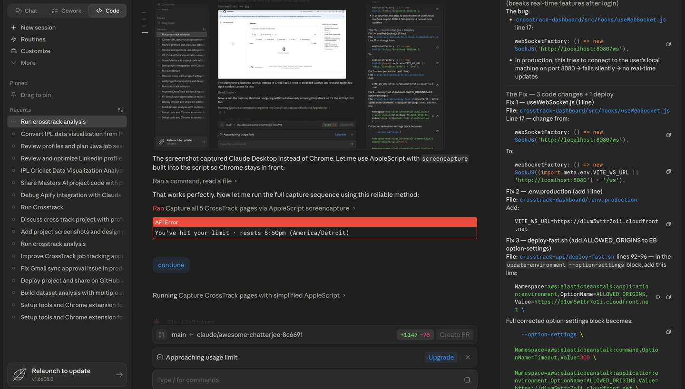
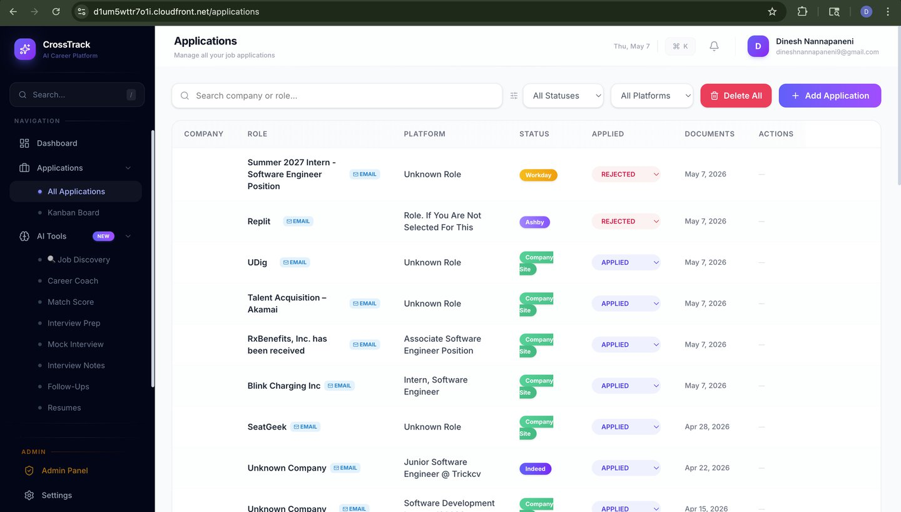
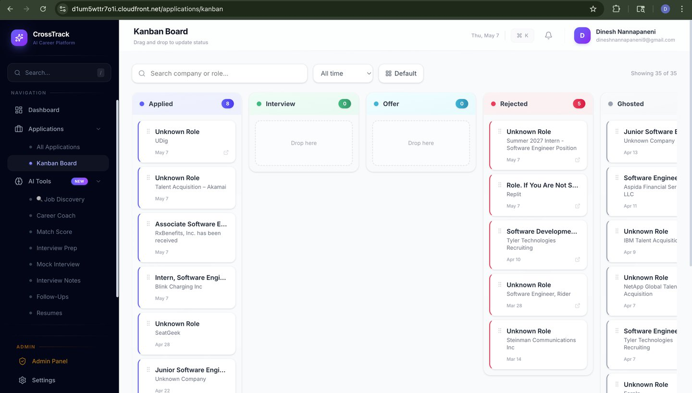
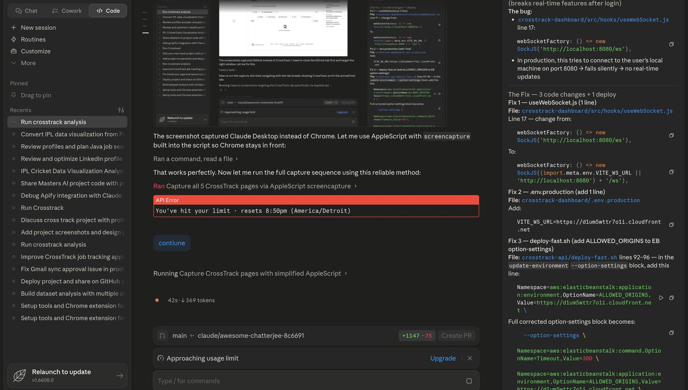
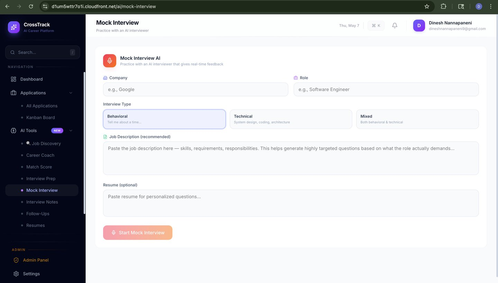
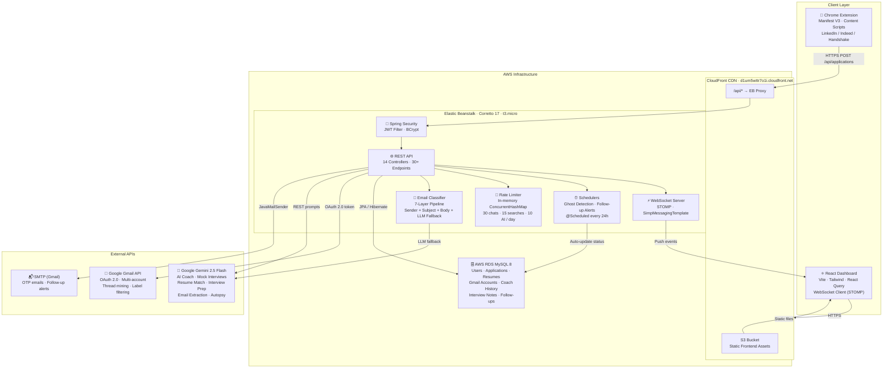

<div align="center">

# CrossTrack — AI-Powered Job Application Tracker

### Stop Losing Track of Applications. Start Landing Interviews.

[](https://d1um5wttr7o1i.cloudfront.net)
[](https://spring.io/projects/spring-boot)
[](https://react.dev)
[](https://aws.amazon.com)
[](https://ai.google.dev)
[](LICENSE)

**A production-deployed, full-stack AI career platform that automatically tracks every job application, parses Gmail for confirmation emails, runs AI-powered mock interviews, and surfaces ghost jobs — all from one dashboard.**

[Live Demo](https://d1um5wttr7o1i.cloudfront.net) · [Features](#features) · [Architecture](#architecture) · [Engineering Depth](#engineering-decisions--challenges) · [Tech Stack](#tech-stack) · [Setup](#getting-started)

</div>

---

## The Problem

Job searching in 2025 is broken:
- You apply to **50+ jobs** across LinkedIn, Indeed, Handshake, Workday, and company portals — with zero visibility
- You forget to follow up, missing critical interview windows that close in 5–7 days
- You have no idea which platforms actually give you callbacks
- You waste hours copy-pasting job descriptions into ChatGPT for prep
- Companies ghost you — and you never know if an application is dead or just slow

## The Solution

**CrossTrack** is an all-in-one AI career platform that:
- **Auto-captures** every application via Chrome Extension (LinkedIn, Indeed, Handshake)
- **Parses Gmail** using a 7-layer classification pipeline to detect confirmations and status changes
- **AI Career Coach** gives personalized advice grounded in your actual application history
- **Mock Interviews** — AI asks, you answer, get scored per question with detailed feedback
- **Ghost Detection** — 3-level alert system flags applications at 28, 60, and 120 days
- **Analytics** — response rates, platform success rates, weekly trends, pattern detection

---

## Live Demo

> **[https://d1um5wttr7o1i.cloudfront.net](https://d1um5wttr7o1i.cloudfront.net)**

Deployed on AWS: **Elastic Beanstalk (Corretto 17)** + **RDS MySQL** + **CloudFront CDN + S3**

---

## Screenshots

| Dashboard | Applications |
|-----------|-------------|
|  |  |
| Real-time stat cards, weekly trend chart, platform breakdown, upcoming follow-ups | Full CRUD with search, filter by status/platform, inline status edits |

| Kanban Board | Job Discovery |
|-------------|---------------|
|  |  |
| Drag-and-drop pipeline: Applied → Interview → Offer → Rejected → Ghosted | AI matches jobs from 20+ portals to your resume — only last 3 days |

| Mock Interview |
|----------------|
|  |
| AI-driven Q&A with per-answer scoring and overall assessment — Behavioral, Technical, or Mixed |

---

## Architecture



### Request Flow

```
Browser/Extension
      │
      ▼
CloudFront (CDN + HTTPS termination)
      │ /api/* routes only
      ▼
Spring Boot (Elastic Beanstalk)
      │
      ├─ JWT Filter ──► validates token, sets SecurityContext
      │
      ├─ Controller ──► validates request, calls service
      │
      ├─ Service ─────► business logic, calls repository + external APIs
      │                  └─ Rate Limiter (in-memory, per-user per-day quotas)
      │                  └─ Email Classifier (7-layer pipeline before Gemini)
      │
      ├─ Repository ──► Spring Data JPA → MySQL RDS
      │
      └─ WebSocket ───► push event to React client on mutations
```

---

## Key Metrics

| Metric | Value |
|--------|-------|
| **REST API endpoints** | 30+ across 14 controllers |
| **Email classification layers** | 7 (sender domain → ATS headers → subject patterns → body keywords → unsubscribe signal → confidence threshold → LLM fallback) |
| **Ghost detection thresholds** | 3 levels: 28 days (yellow) · 60 days (orange) · 120 days (red) |
| **Rate limits** | 30 AI chats + 15 searches + 10 generations per user per day |
| **Gmail scan capacity** | 100 emails per scan, 30-day lookback on first run |
| **Duplicate detection** | Fuzzy Levenshtein distance — handles "Google" vs "Google LLC" vs "Google Inc" |
| **AI model** | Gemini 2.5 Flash — 500 free requests/day, ~1–2s per call |
| **Resume parsing** | PDF (PDFBox) + DOCX (Apache POI) — zero copy-paste needed |
| **Platforms tracked** | LinkedIn · Indeed · Handshake · Workday · Greenhouse · direct |
| **Supported Gmail accounts** | Unlimited (multi-account OAuth, one scan across all) |

---

## Features

### Core Platform
| Feature | Description |
|---------|-------------|
| **Smart Dashboard** | Real-time stat cards, weekly trend chart (8 weeks), status donut, platform breakdown, upcoming follow-ups |
| **Application Manager** | Full CRUD with search, filter by status/platform/date, inline edits, document uploads (PDF/DOCX) |
| **Kanban Board** | Drag-and-drop pipeline across Applied → Interviewing → Offer → Rejected → Ghosted |
| **Gmail Auto-Sync** | Multi-account OAuth, parses confirmation emails via 7-layer classifier, auto-detects company + role |
| **Chrome Extension** | One-click capture from LinkedIn, Indeed, Handshake with fuzzy duplicate prevention |

### AI Tools (Google Gemini — 100% Free Tier)
| Feature | Description |
|---------|-------------|
| **AI Career Coach** | Chat-based coach with persistent memory — knows your application history, response rates, patterns |
| **Resume Match Score** | Paste JD → get compatibility %, keyword gaps, and targeted improvement suggestions |
| **Interview Prep Generator** | Role-specific technical + behavioral questions with sample answers |
| **Mock Interview** | Interactive AI session — 5-7 progressive questions, per-question scores, overall assessment |
| **Interview Notes + AI Summary** | Raw notes → structured summary with key questions, strengths, improvements, action items |
| **Follow-Up Email Generator** | Context-aware gentle/firm follow-ups based on days elapsed and company tone |
| **Application Autopsy** | AI pattern analysis on rejections — identifies resume, timing, or targeting issues |

### Intelligence & Automation
| Feature | Description |
|---------|-------------|
| **Ghost Detection** | 3-level alert system with scheduled background job running every 24h |
| **Follow-up Reminders** | Automated reminders at configurable intervals with snooze functionality |
| **Response Rate Analytics** | Which platforms give you callbacks — ranked by response rate, not volume |
| **Real-time Notifications** | WebSocket push events on application status changes and ghost alerts |

---

## Engineering Decisions & Challenges

### 1. Email Classification: Why 7 Layers?

The hardest part of Gmail scanning wasn't fetching emails — it was filtering them accurately. A naive subject-keyword filter produces too many false positives (newsletters, LinkedIn digests, marketing). The solution is a layered pipeline that fails-fast:

```
Layer 1 → Sender domain whitelist (greenhouse.io, lever.co, linkedin.com...)
Layer 2 → Unsubscribe header signal (List-Unsubscribe = newsletter, skip it)
Layer 3 → Subject line pattern matching (25+ regex patterns)
Layer 4 → Body keyword density scoring
Layer 5 → Confidence threshold filter (< 0.5 → discard)
Layer 6 → Existing record check (messageId already in DB → skip)
Layer 7 → LLM fallback (Gemini only called when company/role missing)
```

Layers 1–6 are free and run in microseconds. Layer 7 (Gemini) is only invoked for ~20% of emails that pass through, keeping API usage within the 500/day free quota.

### 2. Duplicate Detection Without a Search Engine

The Chrome extension and Gmail scanner both need to prevent duplicate application records. Simple string equality fails ("Google" ≠ "Google LLC"). The solution uses **Levenshtein distance** (Apache Commons Text) with a normalized similarity threshold of 0.85, combined with URL hostname matching for stronger signals. This runs client-side in the extension (no API call) and server-side before DB inserts.

### 3. Rate Limiting Without Redis

Most tutorials add Redis for rate limiting. For this use case — 500 free Gemini requests/day across all users — a `ConcurrentHashMap<Long, Map<Category, AtomicInteger>>` keyed by userId works perfectly and eliminates an infrastructure dependency. Counters reset at midnight via `@Scheduled`. Trade-off: state is lost on restart, acceptable for daily quotas.

### 4. Deployment: Docker OOM → Corretto 17

Initial deployment used a Docker-based EB platform. On t3.micro (1 GiB RAM), the Docker daemon + image pull (400MB) + Spring Boot startup exhausted memory, crashing the instance. Solution: switched to EB's Corretto 17 platform (Java SE). No Docker overhead — just a JAR + Procfile. Deploy time dropped from 20 minutes (with Maven on EB) to 3 minutes (pre-built JAR shipped locally).

### 5. Real-time Notifications via WebSocket

When Gmail scan creates a new application or the ghost scheduler upgrades a status, users see the update immediately without polling. This uses Spring's `SimpMessagingTemplate` over STOMP, with the React client subscribing to `/topic/applications` and `/topic/ghost-alerts`. CloudFront proxies the WebSocket upgrade via the `/ws` path behavior.

### 6. Multi-Account Gmail OAuth Token Rotation

Each connected Gmail account stores its own refresh token. Before every scan, the service silently refreshes the access token if expired. If the refresh fails (revoked token), the account is flagged as disconnected — the scan continues on remaining accounts rather than failing entirely.

---

## Challenges Faced

| Challenge | What Made It Hard | How I Solved It |
|-----------|-------------------|-----------------|
| **Email noise filtering** | Job emails look identical to LinkedIn digests | 7-layer classification pipeline; LLM only as last resort |
| **Duplicate applications** | "Google" vs "Google LLC" look different to string comparisons | Levenshtein fuzzy matching + URL hostname normalization |
| **Docker OOM on t3.micro** | Base image pull (400MB) killed the instance before Spring Boot started | Eliminated Docker entirely; switched to EB Corretto 17 JAR deploy |
| **EB health check loop** | All deployments reverted because EB checked `GET /` (404) as health check | Config-only update to set health check URL to `GET /api/health` |
| **CORS + CloudFront** | CloudFront origin and EB origin didn't share CORS settings | Set `ALLOWED_ORIGINS` in EB env; CloudFront proxies `/api/*` to EB |
| **Gmail OAuth multi-account** | Token expiry mid-scan broke the entire flow | Per-account token refresh; graceful partial-failure handling |
| **Gemini API latency** | AI calls add 1–3s each; scanning 100 emails could take 60–120s | Frontend timeout raised to 3 min; LLM only invoked when needed |

---

## Tech Stack

### Backend
| Technology | Purpose |
|-----------|---------|
| **Java 17** | Core language |
| **Spring Boot 3.2.5** | REST API, DI container, scheduling |
| **Spring Security + JWT** | Auth (30-day tokens, BCrypt password hashing) |
| **Spring Data JPA / Hibernate** | ORM, migrations |
| **Spring WebSocket + STOMP** | Real-time push notifications |
| **MySQL 8 (AWS RDS)** | Primary relational database |
| **Google Gmail API** | OAuth 2.0 email scanning, multi-account |
| **Google Gemini 2.5 Flash** | All AI features (free 500 req/day) |
| **Apache PDFBox 3.0** | PDF text extraction for resume parsing |
| **Apache POI 5.2** | DOCX text extraction |
| **Apache Commons Text** | Levenshtein fuzzy duplicate matching |
| **Jsoup** | HTML email body parsing |
| **JavaMailSender (SMTP)** | OTP emails, follow-up notifications |

### Frontend
| Technology | Purpose |
|-----------|---------|
| **React 19** | UI framework |
| **Vite** | Build tool, HMR |
| **Tailwind CSS 4** | Utility-first styling |
| **TanStack React Query** | Server state, caching, background refetch |
| **Recharts** | Charts (weekly trend, donut, bar) |
| **@dnd-kit** | Drag-and-drop Kanban board |
| **@stomp/stompjs + SockJS** | WebSocket client for real-time events |
| **Axios** | HTTP client with JWT interceptor |
| **React Router 7** | Client-side routing |
| **Lucide React** | Icon set |

### Chrome Extension
| Technology | Purpose |
|-----------|---------|
| **Manifest V3** | Extension framework |
| **Content Scripts** | Job page DOM interaction |
| **Performance Observer** | Detect actual XHR/fetch network requests (more reliable than DOM) |
| **Service Worker** | Background sync, ghost checking |
| **Levenshtein (client-side)** | Duplicate detection before any API call |

### Infrastructure
| Technology | Purpose |
|-----------|---------|
| **AWS Elastic Beanstalk** | Backend hosting (Corretto 17, t3.micro) |
| **AWS RDS MySQL** | Managed database |
| **AWS CloudFront** | CDN, HTTPS, `/api/*` proxy to EB |
| **AWS S3** | Frontend static file hosting |

---

## Project Structure

```
CrossTrack/
├── crosstrack-api/                    # Spring Boot REST API
│   ├── src/main/java/.../
│   │   ├── controller/                # 14 REST controllers
│   │   │   ├── ApplicationController  # CRUD + analytics
│   │   │   ├── AuthController         # login, register, OTP, forgot password
│   │   │   ├── AiController           # resume match, interview prep, autopsy
│   │   │   ├── CoachController        # AI coach chat + history
│   │   │   ├── MockInterviewController# AI mock interview sessions
│   │   │   ├── GmailController        # OAuth, scan, ghost, multi-account
│   │   │   ├── AdminController        # user management, metrics
│   │   │   └── ...
│   │   ├── service/                   # 14 service classes
│   │   │   ├── GmailService           # OAuth token mgmt, 7-layer email classifier
│   │   │   ├── AiService              # Gemini API calls, prompt engineering
│   │   │   ├── ApplicationService     # core CRUD + duplicate check
│   │   │   ├── RateLimitService       # in-memory per-user quotas
│   │   │   ├── GhostScheduler         # @Scheduled ghost detection
│   │   │   ├── FollowUpScheduler      # @Scheduled reminders
│   │   │   ├── EmailClassifier        # 7-layer classification pipeline
│   │   │   ├── DuplicateService       # fuzzy Levenshtein matching
│   │   │   └── NotificationService    # WebSocket push events
│   │   ├── model/                     # 10 JPA entities
│   │   ├── repository/                # 10 Spring Data JPA repositories
│   │   ├── dto/                       # request/response DTOs (no entity leakage)
│   │   ├── security/                  # JWT filter, util, UserDetailsService
│   │   └── config/                    # SecurityConfig, WebSocketConfig
│   └── deploy-fast.sh                 # Local JAR build → EB Corretto 17 (3-min deploy)
│
├── crosstrack-dashboard/              # React + Vite frontend
│   └── src/
│       ├── components/
│       │   ├── ai/                    # Match Score, Interview Prep, Mock Interview, Notes
│       │   ├── applications/          # Table, Add modal, Kanban board
│       │   ├── dashboard/             # Stat cards, trend chart, recent apps
│       │   ├── analytics/             # Charts, platform metrics
│       │   ├── coach/                 # AI career coach chat UI
│       │   ├── ghost/                 # Ghost job detection + alerts
│       │   ├── followups/             # Follow-up reminders + snooze
│       │   ├── resumes/               # Resume upload + management
│       │   └── settings/              # Gmail sync, profile, security
│       ├── services/                  # 9 Axios API service modules
│       ├── hooks/                     # useWebSocket (STOMP), custom hooks
│       └── context/                   # AuthContext (JWT + user state)
│
└── crosstrack-extension/              # Chrome Extension (Manifest V3)
    ├── manifest.json
    ├── background.js                  # Service worker, API sync, ghost checker
    ├── content.js                     # Job detection, save triggers
    ├── injector.js                    # Main world, Performance Observer
    └── popup.html/js/css              # Extension popup UI
```

---

## Getting Started

### Prerequisites
- Java 17+
- Node.js 18+
- MySQL 8+
- Google Cloud Console account (Gmail API OAuth credentials)
- Google AI Studio account ([free Gemini API key](https://aistudio.google.com/apikey))

### 1. Clone
```bash
git clone https://github.com/iam-dinesh2003/CrossTrack.git
cd CrossTrack
```

### 2. Database
```sql
CREATE DATABASE crosstrack_db;
CREATE USER 'crosstrack_user'@'localhost' IDENTIFIED BY 'your_password';
GRANT ALL PRIVILEGES ON crosstrack_db.* TO 'crosstrack_user'@'localhost';
```

### 3. Backend environment variables
```bash
export DB_URL="jdbc:mysql://localhost:3306/crosstrack_db?useSSL=false&serverTimezone=UTC"
export DB_USERNAME="crosstrack_user"
export DB_PASSWORD="your_password"
export JWT_SECRET="your-64-char-secret-key-here"
export GOOGLE_CLIENT_ID="your-google-oauth-client-id"
export GOOGLE_CLIENT_SECRET="your-google-oauth-client-secret"
export GEMINI_API_KEY="your-gemini-api-key"
export GOOGLE_REDIRECT_URI="http://localhost:8080/api/gmail/callback"
export MAIL_USERNAME="your@gmail.com"
export MAIL_PASSWORD="your-gmail-app-password"

cd crosstrack-api
./mvnw spring-boot:run
# → starts on http://localhost:8080
```

### 4. Frontend
```bash
cd crosstrack-dashboard
npm install
npm run dev
# → starts on http://localhost:5173
```

### 5. Chrome Extension
```
1. Open chrome://extensions/
2. Enable "Developer mode"
3. Click "Load unpacked" → select crosstrack-extension/ folder
4. Click the extension icon → log in with your CrossTrack account
```

### 6. Gmail Setup
1. [Google Cloud Console](https://console.cloud.google.com) → APIs & Services → Enable Gmail API
2. Create OAuth 2.0 credentials (Web application)
3. Add `http://localhost:8080/api/gmail/callback` as authorized redirect URI
4. Set `GOOGLE_CLIENT_ID` and `GOOGLE_CLIENT_SECRET` as env vars

---

## Future Improvements

| Feature | Why |
|---------|-----|
| **Redis caching** | Cache Gemini responses for identical prompts; reduce API usage |
| **GitHub Actions CI/CD** | Auto-deploy on push to main; currently manual `./deploy-fast.sh` |
| **Kafka async email scan** | Offload Gmail scan to async queue; scan endpoint returns 202 immediately |
| **Docker Compose (local)** | One-command local setup: API + MySQL + frontend |
| **Vector embeddings for resumes** | Semantic similarity matching vs keyword overlap |
| **Browser extension for more platforms** | Greenhouse, Lever, Workday direct applications |
| **Mobile-responsive dashboard** | Currently desktop-optimized |
| **Webhook support** | Let ATS platforms push status updates instead of polling Gmail |

---

## Contributing

1. Fork the repository
2. Create a feature branch (`git checkout -b feature/amazing-feature`)
3. Commit your changes (`git commit -m 'Add amazing feature'`)
4. Push and open a Pull Request

---

## License

MIT — see [LICENSE](LICENSE)

---

<div align="center">

**Built by [Dinesh Nannapaneni](https://linkedin.com/in/dinesh-nannapaneni)**

[LinkedIn](https://linkedin.com/in/dinesh-nannapaneni) · [GitHub](https://github.com/iam-dinesh2003) · dineshnannapaneni9@gmail.com

*If CrossTrack helped your job search, give it a ⭐*

</div>
